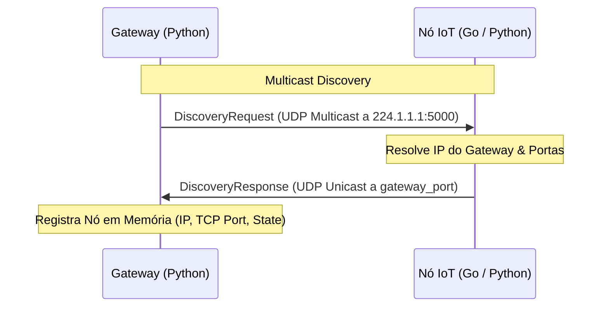
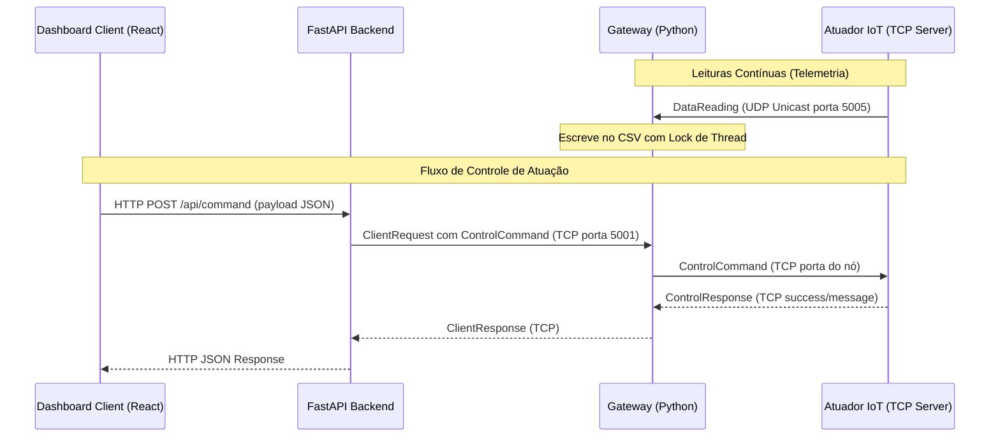

# Smart City IoT - Plataforma Distribuída

Este projeto implementa uma infraestrutura de cidade inteligente baseada em **Sistemas Distribuídos**, integrando microsserviços heterogêneos para monitoramento ambiental e controle atuado em tempo real. Toda a comunicação do ecossistema é fortemente tipada utilizando **Protocol Buffers (protobuf)**.

---

## 🏗️ Arquitetura Geral do Sistema

O ecossistema é composto por quatro divisões principais:
1. **Gateway Inteligente** ([gateway/main.py]): Nó concentrador central que descobre nós IoT por Multicast, ingere leituras contínuas por UDP de forma não-bloqueante e gerencia o envio de comandos por TCP.
2. **Fontes de Dados (Sensores e Atuadores)**: Dispositivos IoT heterogêneos (escritos em **Python** e **Go**) distribuídos pela cidade.
3. **Servidor API Backend** ([dashboard/api.py]): Ponte REST FastAPI de alta performance que lê de forma vetorizada (pandas) os dados consolidados do Gateway e expõe endpoints para a interface.
4. **Dashboard Front-end** ([dashboard/web/src/App.jsx]: Interface interativa de alta fidelidade visual para acompanhamento temporal, alertas e acionamento de nós.

---

## 📊 Fluxo de Comunicação e Ciclo de Vida

A topologia de rede é dinâmica e assíncrona, operando com os seguintes protocolos e fluxos:

### 1. Descoberta Dinâmica de Nós (Multicast UDP)
O Gateway anuncia periodicamente seu endereço IP e portas ativas enviando pacotes em rede local via Multicast UDP no grupo reservado `224.1.1.1:5000`. Os nós escutam esse canal e respondem diretamente ao Gateway via UDP para registrar sua entrada.



### 2. Ingestão de Dados e Controle Remoto
* **Telemetria (UDP Unicast):** Sensores enviam dados de leitura em rajadas de alto rendimento para a porta UDP do Gateway (`5005`) sem acoplamento de conexão.
* **Controle Atuador (TCP):** O painel do cliente envia comandos para a API, que encaminha via canal TCP (`5001`) para o Gateway. O Gateway estabelece uma conexão TCP ponta a ponta com a porta local do atuador alvo (`6001-6004`) para garantir a entrega segura do comando.



---

## 🧬 Contratos de Comunicação (Protobuf)

A padronização das trocas de mensagens está definida em [proto/messages.proto]. O schema protobuf garante contratos estritos e serialização binária otimizada entre o Gateway (Python) e o Semáforo (Go).

* **Mensagens Principais:**
  * `DiscoveryRequest`: Contém `gateway_ip`, `gateway_udp_port` e `gateway_tcp_port`.
  * `DiscoveryResponse`: Contém metadados de identificação do nó (`source_id`, `type`, `ip`, `tcp_port`, `initial_state`).
  * `DataReading`: Transmite leituras contínuas com campos de identificador (`source_id`), tipo (`type`), valor em número ponto flutuante (`value`), unidade física (`unit`) e carimbo de data/hora (`timestamp`).
  * `ControlCommand` e `ControlResponse`: Gerenciam ordens enviadas de cima para baixo (`command` e `parameter`) e o relatório de confirmação.

---

## ⚙️ Detalhamento Lógico dos Componentes e Nós IoT

Para demonstrar a heterogeneidade e interoperabilidade de sistemas distribuídos, os nós utilizam pilhas tecnológicas distintas:

### 🚦 O Nó em Go (Golang)
O **Semáforo (`semaforo_01`)** está localizado em [sources/semaforo/main.go]:
* **Comunicação:** Escuta o canal multicast em Go para encontrar o IP do Gateway e abre um servidor TCP na porta `6004` para escuta de ordens remotas.
* **Lógica Interna:** Executa uma goroutine concorrente (`runSemaphores`) que altera ciclicamente o estado físico da via (`verde` -> `amarelo` -> `vermelho`) de acordo com um temporizador (`cycleTime`).
* **Interatividade de Estado:** Aceita ordens externas via TCP para mudar forçadamente o estado (`SET_STATE` para uma das três cores) ou redefinir a duração padrão do ciclo de troca (`SET_CYCLE`). A cada mudança interna, reenvia seu pacote cadastral ao Gateway para notificar o painel em tempo de execução.

### 🐍 Os Nós em Python
Os demais dispositivos residem em subpastas de `sources/` e são escritos em Python:
1. **Sensor de Qualidade do Ar (`sensor_ar_01`)** em [sources/qualidade_ar/main.py]:
   * Mede gases em PPM (partes por milhão).
   * **Bloqueio de Parâmetros:** Mantém o limiar padrão de alerta em **1400ppm**.
   * **Simulação de Falha:** Possui um temporizador de falhas intermitente (veja detalhes abaixo).
2. **Sensor de Temperatura (`sensor_temp_01`)** em [sources/temperatura/main.py]:
   * Dispara leituras flutuantes de graus Celsius a cada 5 segundos.
   * **Simulação de Falha:** Implementa loops de bloqueio intermitentes para testar a resiliência do Gateway.
3. **Câmera de Monitoramento (`camera_01`)** em [sources/camera/main.py]:
   * Atuador controlável via TCP na porta `6001`.
   * Possui estados binários padronizados (`LIGADO` / `DESLIGADO`) e capacidade de alteração da resolução de streaming (`SET_RESOLUTION` para `720p`, `1080p`, etc).
4. **Poste de Iluminação Pública (`poste_01`)** em [sources/poste_iluminacao/main.py]):
   * Atuador controlável via TCP na porta `6002`.
   * Permite alternar seu estado geral (`LIGADO` / `DESLIGADO`) e dosar a intensidade luminosa das lâmpadas LED (`SET_INTENSITY` para `50%` ou `100%`).

---

## 🛡️ Mecanismo de Watchdog, Falhas e Resiliência Gráfica

Uma característica crucial de sistemas distribuídos robustos é o tratamento transparente de faltas de hardware de rede. Este projeto simula e resolve esse problema na íntegra:

### 1. Simulação de Falhas Físicas
Os sensores `sensor_temp_01` e `sensor_ar_01` possuem uma thread que injeta falhas físicas intermitentes. Em 10% das execuções de envio de telemetria, os sensores entram em um travamento síncrono (`sleep` por 20 segundos). Durante esse intervalo, as comunicações de rede UDP com o Gateway cessam.

### 2. O Watchdog do Gateway
No Gateway, uma thread dedicada executa em segundo plano a cada 5 segundos analisando o campo `last_seen` (timestamp de recepção ativa) registrado na memória RAM para **todas as fontes monitoradas** na rede.
* Se o Gateway não receber nenhuma mensagem (seja telemetria ou heartbeat) de um determinado sensor/atuador por mais de **15 segundos**, ele declara a fonte como **`OFFLINE`**.
* O Gateway então grava ativamente no arquivo de dados históricos CSV (`data/dados_gateway.csv`) um registro de inatividade:
  * O campo `value` é definido como `0.0`.
  * O campo `unit` é preenchido com a string sentinela **`OFFLINE`**.

### 3. Heartbeats e Tolerância a Queda do Servidor
Seguindo o rigor de arquiteturas distribuídas connectionless, os nós implementam um **Timeout Passivo** baseado em Discovery:
* Os nós esperam pacotes `DiscoveryRequest` do Gateway a cada 30 segundos.
* Se o Gateway cair, os dispositivos esbarram num limite de **35 segundos**. Eles pausam inteligentemente os envios UDP para poupar banda local e aguardam até o Gateway reviver.
* Atuadores (mesmo físicos "Desligados") enviam pings de status a cada 10s para manterem sua presença ativa no Watchdog.
* O painel exibe uma métrica dinâmica chamada **"Taxa de Falhas (Uptime)"**, calculada como:
  $$\text{Taxa de Falhas (\%)} = \frac{\text{Amostras OFFLINE}}{\text{Total de Amostras}} \times 100$$

---

## 🎨 O Dashboard de Controle e Métricas Analíticas

O Dashboard oferece uma visualização clean baseada em aplicações financeiras modernas, operando em *Dark Mode* de alta fidelidade visual.

### Principais Funcionalidades do Dashboard:
* **Filtro de Cards Dinâmico:** Clicar em qualquer nó na lista do painel lateral esquerdo altera automaticamente o gráfico ativo e as métricas de acompanhamento exibidas no lado direito.
* **Filtros Temporais Ajustáveis:** Menus *dropdown* no canto superior direito permitem selecionar entre carregar o histórico de dados na íntegra ("All Data") ou aplicar zooms apenas nas últimas 10 ou 50 leituras.
* **Botões de Controle Padronizados:** Comandos para Atuadores (Câmera, Poste e Semáforo) são expostos como botões (`ON`, `OFF`, `50%`, `100%`) com estados de seleção marcados visualmente pela troca de cores e realces luminosos.
* **Métricas Estatísticas Específicas por Filtro:**
  * **Médias, Mínimas e Máximas** separadas em blocos individuais e independentes.
  * **Semáforo:** Contagem do número de mudanças de estado registradas.
  * **Câmera:** Volume total de frames capturados.
  * **Poste:** Horas equivalentes acumuladas em que a luz permaneceu ativa (soma ponderada das leituras ativas de 10 segundos).
  * **Temperatura:** Total de "Hot Events" coletados (leituras acima do limiar crítico de 30°C).
  * **Qualidade do Ar:** Exibição proporcionalizada em porcentagens (%) do tempo histórico gasto em cada faixa de CO2:
    * Fresco ($\leq 400$ ppm)
    * Normal ($401 - 1000$ ppm)
    * Ruim ($1001 - 1400$ ppm)
    * Alta Concentração ($> 1400$ ppm)
* **Zonas Limitrofes nos Gráficos (Reference Zones):**
  * O gráfico de qualidade do ar apresenta demarcações visuais coloridas (com translucidez suave) de acordo com os limiares recomendados, marcando visualmente as faixas saudáveis, normais e de perigo, além de exibir um alerta explícito com linha tracejada vermelha no valor máximo de 1400ppm.
  * O gráfico de temperatura delimita a linha vermelha tracejada no patamar crítico de 30°C com rótulos indicativos flutuantes.

---

## 🚀 Como Executar o Projeto

Você tem duas opções para executar os microsserviços da Smart City: via **Docker** (recomendado para facilitar a reprodutibilidade) ou de forma **Local/Manual**.

### Opção 1: Via Docker (Recomendado)
A maneira mais fácil de rodar todo o ambiente isolado e livre de problemas de compatibilidade de SO e dependências é usando o **Docker Compose**. Ele criará todos os 8 serviços simultaneamente em uma rede virtual isolada e fará os links automaticamente.

**Pré-requisito:**
* [Docker](https://www.docker.com/) e [Docker Compose](https://docs.docker.com/compose/) instalados na máquina.

**Execução:**
Abra o terminal na raiz do projeto e execute:
```bash
docker-compose up --build
```
Após o build, a API e o painel web ficarão disponíveis automaticamente em seu localhost:
* **Dashboard:** [http://localhost:5173](http://localhost:5173)
* **Backend API (Swagger docs):** [http://localhost:8000/docs](http://localhost:8000/docs)

*Para desligar tudo, basta usar `Ctrl+C` no console ou rodar `docker-compose down`.*

---

### Opção 2: Inicialização Manual (Scripts Locais)
Caso prefira não utilizar o Docker e desejar testar nativamente o ambiente.

#### Pré-requisitos
* Python 3.12 ou superior instalado.
* Go (Golang) configurado no path do sistema.
* Gerenciador de pacotes Node.js e npm.

#### Passo 1: Inicializar a Rede de Sensores (Python) e o Gateway
No seu **primeiro terminal**, execute o script shell automatizado. Ele cria e ativa o ambiente virtual Python `.venv`, instala dependências do projeto e coloca em paralelo o Gateway e os quatro sensores escritos em Python:
```bash
./start.sh
```
*Mantenha este terminal ativo para visualizar as trocas de descoberta e logs UDP de telemetria no console.*

#### Passo 2: Executar o Semáforo (Go)
Abra um **segundo terminal** para compilar e inicializar o nó do semáforo escrito em Go:
```bash
cd sources/semaforo
go mod tidy
go run main.go
```
*Assim que o processo iniciar, ele escutará as chamadas Multicast UDP e se integrará à topologia de rede do Gateway automaticamente.*

#### Passo 3: Iniciar o Dashboard (API Backend + React Frontend)
Abra um **terceiro terminal** e execute o inicializador do painel interativo:
```bash
./start_dashboard.sh
```
O script iniciará o servidor backend FastAPI (porta `8000`) e o painel cliente web React/Vite.
Abra seu navegador no endereço: **[http://localhost:5173](http://localhost:5173)**.

---

## 🛠️ Stack Tecnológica Completa
* **Comunicação / Mensageria:** Protocol Buffers (protobuf v3), Conexões Raw UDP (Multicast & Unicast), Conexões Raw TCP (Streams de controle).
* **Back-end de Rede & Persistência:** Python 3.12+, Pandas (leitura vetorizada e manipulação assíncrona do CSV contínuo).
* **Back-end do Painel:** FastAPI, Uvicorn, Pydantic.
* **Nó IoT de Alta Performance:** Go (Golang).
* **Front-end Web:** React 18, Vite, Recharts, Lucide-React, CSS Custom Variables (Design System customizado).
